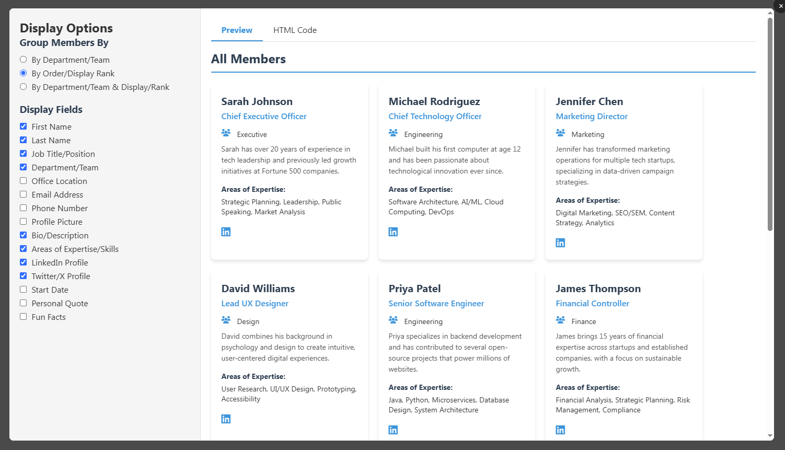

# csv2team

A lightweight, browser-based tool for creating customizable team directory pages from CSV data without requiring server-side processing or complex frameworks.



## Table of Contents

- [Overview](#overview)
- [Technology Stack](#technology-stack)
- [Features](#features)
- [How to Use](#how-to-use)
- [CSV Format](#csv-format)
- [Customization Options](#customization-options)
- [Browser Compatibility](#browser-compatibility)
- [License](#license)

## Overview

Team Directory Generator is a simple web application that allows you to create professional-looking team directory pages from CSV data. With an intuitive interface, you can customize the display of your team members, preview the results, and export the HTML code for use on your website.

## Technology Stack

This application is built using pure client-side technologies:

- **HTML5**: For structure and markup
- **CSS3**: For styling and responsive design
- **jQuery**: For DOM manipulation and event handling
- **PapaParse**: A powerful CSV parser for handling tabular data
- **Font Awesome**: For social media icons and UI elements

No server-side processing is required, making this tool extremely portable and easy to deploy.

## Features

- **CSV Data Import**: Easily import team member data via CSV paste
- **Real-time Preview**: See changes as you make them
- **Customizable Display**: Toggle individual fields on/off
- **Flexible Grouping**: Group team members by department, display rank, or both
- **Export HTML**: Export the fully styled HTML code ready for your website
- **Responsive Design**: Card-based layout works on various screen sizes
- **Social Media Integration**: Links to LinkedIn and Twitter/X profiles

## How to Use

1. **Open the HTML File**: Load the `index.html` file in any modern web browser

2. **Input CSV Data**: Paste your team member CSV data into the textarea
   - The CSV must follow the required format (see [CSV Format](#csv-format) below)

3. **Preview Your Team Directory**: Click the "Preview HTML" button to open the preview overlay

4. **Customize the Display**:
   - On the left panel, choose how to group members (by department, rank, or both)
   - Toggle specific fields on/off using the checkboxes
   - Watch the preview update in real-time on the right panel

5. **View and Export the HTML Code**:
   - Click the "HTML Code" tab to see the generated HTML
   - Click "Copy Code" to copy the HTML to your clipboard
   - Paste the code into your website or CMS

6. **Close and Refine**: Close the preview overlay to make changes to your CSV data if needed

## CSV Format

Your CSV data must include the following columns (header names must match exactly):

```
First Name,Last Name,Job Title/Position,Department/Team,Office Location,Public Email Address,Public Phone Number,Profile Picture URL/Filename,Short Bio/Description,Areas of Expertise/Skills,LinkedIn Profile URL,Twitter/X Profile URL,Start Date with Company,Personal Quote,Fun Facts,Order/Display Rank
```

Example row:
```
Sarah,Johnson,Chief Executive Officer,Executive,New York,sarah.johnson@example.com,+1-212-555-0101,sarah_johnson.jpg,"Sarah has over 20 years of experience in tech leadership and previously led growth initiatives at Fortune 500 companies.","Strategic Planning, Leadership, Public Speaking, Market Analysis","https://linkedin.com/in/sarahjohnson","https://twitter.com/sarahjohnson",2018-06-15,"Innovation distinguishes between a leader and a follower.","Sarah has climbed Mount Kilimanjaro and speaks fluent Mandarin.",1
```

### Notes on CSV Format:
- The first row must contain the exact column headers shown above
- Text fields containing commas must be enclosed in double quotes
- Profile Picture URL can be a relative path or full URL
- Order/Display Rank should be a number (used for sorting)

## Customization Options

### Member Grouping
- **By Department/Team**: Groups members according to their department or team
- **By Order/Display Rank**: Shows all members in a single list sorted by rank
- **By Department/Team & Display/Rank**: Groups by department first, then sorts by rank within each group

### Display Fields
Toggle any of these fields to customize your team directory:
- First Name
- Last Name
- Job Title/Position
- Department/Team
- Office Location
- Email Address
- Phone Number
- Profile Picture
- Bio/Description
- Areas of Expertise/Skills
- LinkedIn Profile
- Twitter/X Profile
- Start Date with Company
- Personal Quote
- Fun Facts

## Styling and Appearance

The team directory uses a modern card-based layout with a clean, professional design:

- **Color Scheme**: Blue and dark gray accents on a white background
- **Typography**: Sans-serif fonts (Segoe UI, with fallbacks)
- **Card Design**: Subtle shadows and hover effects
- **Responsive**: Cards adjust to fit different screen sizes

You can customize the styling by modifying the CSS in the exported HTML code.

## Browser Compatibility

This tool works in all modern browsers:
- Chrome (latest)
- Firefox (latest)
- Safari (latest)
- Edge (latest)

## Implementation Notes

### For Developers

If you want to modify the generator:

- The main functionality is in the JavaScript section at the bottom of the HTML file
- PapaParse handles CSV parsing with dynamic typing and header recognition
- The HTML generation is handled by template literals in JavaScript
- The CSS for both the generator interface and the exported team directory is in the style section

### Integration Tips

To integrate the generated team directory into your website:

1. Copy the exported HTML code
2. Paste it into your webpage where you want the directory to appear
3. Ensure the Font Awesome CSS is included in your page (or host the icons locally)
4. Check that image paths are correct for your server structure

## License

This project is released under the MIT License. Feel free to use, modify, and distribute it as needed.

---

Created with ❤️ by [Bhupal Sapkota / Berkeley Computer]